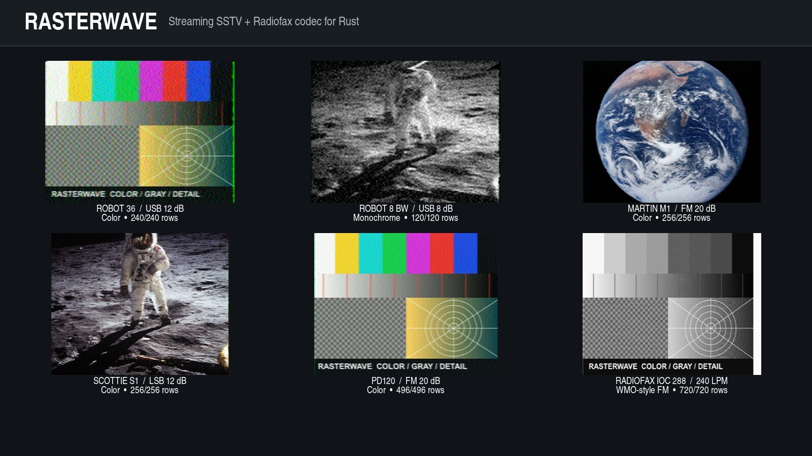

# Rasterwave.rs

High-performance streaming SSTV and radiofax codecs for Rust.

Rasterwave turns raster images into phase-continuous audio and turns a live
audio stream back into image rows. The same state machines power streaming and
one-shot APIs, so a WAV file, a sound-card callback, and a future Node.js worker
all observe the same protocol behavior.



The crate is library-first: it does not open audio devices, key a transmitter,
spawn threads, or depend on an async runtime.

## Highlights

- Streaming SSTV encoder that fills caller-owned PCM buffers without building
  a complete WAV in memory.
- Streaming SSTV decoder with automatic VIS detection, sync-timing candidates,
  frequency-offset tracking, bounded acquisition history, and immediate row
  events.
- Optional immediate decoding starts any caller-selected SSTV mode or fixed
  radiofax profile with the first PCM sample. Later SSTV sync pulses still
  correct timing and frequency, while missing headers or weak signals do not
  block row output.
- Dedicated continuous-paper decoders print fallback snow immediately, detect
  protocol boundaries in parallel, and keep emitting rows after a trusted
  SSTV image or APT-delimited fax page completes.
- VIS candidates are checked against subsequent sync timing before an image is
  started. Ambiguous no-VIS timing reports candidates instead of inventing an
  exact mode.
- Provisional and revised rows for formats such as Robot 36, where chroma spans
  adjacent radio lines.
- WMO-style radiofax framing with IOC 288/576, configurable LPM, APT
  selection, phasing, dead sector, confirmed stop pattern, and black tail.
- Parameterized FM and AM radiofax subcarriers. Clean PCM encode/decode loops
  cover both; over-air and third-party interoperability are separate checks.
- `f32` and `i16` streaming decode inputs plus one-shot convenience functions.
- No mutable global codec state and no `unsafe` code. Independent sessions are
  `Send + Sync`; mutation requires `&mut self` and therefore remains ordered.
- Objective image comparison helpers (MSE, PSNR, block SSIM) and Criterion
  throughput benchmarks.

## Status

Rasterwave is an early `0.2` API intended for integration and interoperability
work. The encoder and decoder share one immutable mode catalog.

The primary built-in profiles currently include:

- Robot BW 8/12/24/36, Robot Color 24/36/72
- Martin M1/M2/M3/M4
- Scottie S1/S2/S3/S4/DX
- PD50/90/120/160/180/240/290
- Pasokon P3/P5/P7
- Wraase SC2-180

Compatibility profiles with conflicting or incomplete historical definitions
are marked by `ModeStatus::Compatibility`: Robot Color 12 and Wraase
SC2-30/60/120.

The public `ModeStatus::Canonical` name means Rasterwave's preferred,
source-backed profile rather than formal standardization or interoperability
certification. See the per-family provenance matrix before relying on an exact
wire timing.

Legacy SSTV FAX480 is deliberately not advertised yet. Its original framing is
APT plus phasing without VIS; treating later VIS code 85 as an ordinary SSTV
header is not interoperable. Meteorological radiofax is implemented separately
under `rasterwave::fax`.

## Install

Add the published crate with Cargo:

```bash
cargo add rasterwave
```

Or declare the dependency directly:

```toml
[dependencies]
rasterwave = "0.2"
```

The minimum supported Rust version is 1.85.

## Streaming SSTV Encode

```rust
use rasterwave::{EncodeOptions, Rgb, RgbImage, SstvEncoder, SstvMode};

fn encode(mut write_audio: impl FnMut(&[f32])) -> rasterwave::Result<()> {
    let mode = SstvMode::Robot36;
    let spec = mode.spec();
    let image = RgbImage::filled(spec.width, spec.height, Rgb::new(32, 128, 224));
    let mut encoder = SstvEncoder::new(
        image,
        mode,
        48_000,
        EncodeOptions::default(),
    )?;

    let mut pcm = [0.0_f32; 1024];
    while !encoder.is_finished() {
        let written = encoder.read_samples(&mut pcm);
        write_audio(&pcm[..written]);
    }
    Ok(())
}
```

Segment deadlines accumulate on one continuous sample timeline. Rounding error
is bounded to one sample over a complete transmission, including at 44.1 kHz.

## Streaming SSTV Decode

The hot API borrows row pixels for the duration of a synchronous callback. It
does not allocate an owned event for every line.

```rust
use rasterwave::{
    DecodeEventRef, DecodeSink, DecoderConfig, SstvDecoder,
};

struct Display;

impl DecodeSink for Display {
    fn on_event(&mut self, event: DecodeEventRef<'_>) {
        match event {
            DecodeEventRef::ModeCandidate { candidates, confidence } => {
                println!("candidate modes: {candidates:?} ({confidence:.2})");
            }
            DecodeEventRef::LineReady {
                line_index,
                revision,
                pixels,
                ..
            } => {
                // Copy or render this row before returning.
                println!("row {line_index}, revision {revision}: {} px", pixels.len());
            }
            _ => {}
        }
    }
}

fn decode(audio_chunks: &[&[f32]]) -> rasterwave::Result<()> {
    let mut decoder = SstvDecoder::new(48_000, DecoderConfig::default())?;
    let mut display = Display;
    for chunk in audio_chunks {
        decoder.push_f32(chunk, &mut display)?;
    }

    // Empty input is a no-op. EOF is explicit:
    decoder.finish(&mut display)?;
    Ok(())
}
```

Call `mark_discontinuity()` when PCM was dropped. Concatenating discontinuous
audio silently would corrupt line timing.

For queues and language bindings, use `DecodeEventRef::to_owned()` or
`SstvDecoder::process_into()`. `encode_sstv()` and `decode_sstv()` provide
one-shot helpers built on the same streaming engines.

## Continuous Receiver Paper

`SstvPaperDecoder` and `FaxPaperDecoder` are presentation-neutral orchestration
layers over the framed protocol decoders. They separate three concerns:
continuous fallback raster output, protocol acquisition, and trusted capture
ranges. Automatic SSTV starts as Robot 36 Color; automatic fax starts as
IOC576/120 LPM/FM and evaluates FM and AM acquisition paths in parallel.

```rust
use rasterwave::{SstvPaperConfig, SstvPaperDecoder, SstvPaperEventRef};

fn receive(chunks: &[&[f32]]) -> rasterwave::Result<()> {
    let mut decoder = SstvPaperDecoder::new(48_000, SstvPaperConfig::default())?;
    for chunk in chunks {
        decoder.push_f32(chunk, &mut |event: SstvPaperEventRef<'_>| {
            match event {
                SstvPaperEventRef::Boundary { kind, line_index, .. } => {
                    println!("divider {kind:?} before row {line_index}");
                }
                SstvPaperEventRef::LineReady { line_index, pixels, .. } => {
                    println!("paper row {line_index}: {} px", pixels.len());
                }
                _ => {}
            }
        })?;
    }
    Ok(())
}
```

Paper row indices never reset at nominal image height. A trusted VIS/sync or
APT/phasing boundary opens a capture range; completion closes only that range
while fallback paper output continues. Signal loss and discontinuity emit a
divider but never masquerade as successful protocol completion.

## Radiofax

```rust
use rasterwave::GrayImage;
use rasterwave::fax::{FaxEncoder, FaxEncodeOptions, FaxIoc, FaxLpm, FaxSpec};

fn fax_encoder() -> rasterwave::Result<FaxEncoder> {
    let spec = FaxSpec::standard(FaxIoc::Ioc576, FaxLpm::LPM_120);
    let page = GrayImage::new(
        spec.active_width(),
        800,
        vec![255; spec.active_width() as usize * 800],
    )?;
    FaxEncoder::new(page, spec, 48_000, FaxEncodeOptions::default())
}
```

IOC is a geometric invariant, not a pixel width. Rasterwave's default square
sampling policy uses full widths of 905/1810 and active picture widths of
864/1728 for IOC 288/576. The encoder accepts active-width or full-width input,
synthesizes the reserved dead sector, and the decoder emits full-width rows.
Radiofax height remains open until APT stop, EOF, signal loss, or a
caller-supplied bound.

WMO-listed rates are 60, 90, 120, and 240 LPM; those are also the decoder's
automatic inference set. 180 LPM is available as an explicit interoperability
extension and must be configured on receive. Default acquisition detects IOC
from APT and timing from phasing. Phasing-only input is supported when IOC is
preconfigured; image-only input cannot establish timing automatically. A
confirmed 450 Hz stop closes a page, while configured target-carrier
level/coherence loss closes it as partial without generating rows from silence
or broadband noise. An upstream squelch can disable the coherence threshold and
apply a stricter receiver-specific policy.

## Threading Contract

- Each encoder or decoder owns all oscillator, detector, ring-buffer, plane,
  and scratch state.
- A session can move to any worker thread (`Send`).
- Independent sessions can run concurrently.
- One stream remains a single ordered writer because processing takes
  `&mut self`.
- The core intentionally has no Tokio, Promise, thread pool, mutex, or Node-API
  dependency. A binding should serialize work per handle and parallelize across
  handles.

See [Architecture](docs/ARCHITECTURE.md) for the intended Node.js boundary.
See [Building Rasterwave](docs/BUILDING.md) for toolchain and platform details.
The complete, Cargo-compiled SSTV example is
[examples/streaming.rs](examples/streaming.rs).

## Build And Verify

```bash
cargo build --release
cargo test --all-targets
cargo fmt --check
cargo clippy --all-targets -- -D warnings
cargo bench --bench codec
cargo doc --no-deps
```

Focused integration tests cover chunk-boundary invariance, VIS offsets to
`+/-250 Hz`, no-VIS mode detection, ambiguity handling, line-before-EOF
delivery, radiofax APT/phasing and phasing-only acquisition, clean FM/AM
self-loops, stop/signal-loss behavior, and multi-threaded independent sessions.

## Performance Snapshot

Apple M1 Max, macOS 26.5.2, Rust 1.87, release profile with thin LTO:

| Benchmark | Time | Throughput |
| --- | ---: | ---: |
| Robot 36 encode at 12 kHz | 4.03 ms | 110 M samples/s |
| Martin M1 encode at 12 kHz | 6.70 ms | 206 M samples/s |
| PD290 encode at 12 kHz | 25.0 ms | 139 M samples/s |
| Robot 8 decode at 12 kHz | 8.07 ms | 13.1 M samples/s |
| IOC576/120 LPM fax encode | 262 us | 183 M samples/s |

These numbers are development snapshots, not cross-platform guarantees.

## Specifications And Provenance

SSTV has no single formal standards body. Rasterwave records which source wins
when historical tables disagree. Meteorological radiofax framing is based on
WMO-No. 386 and CCIR Recommendation 343-1; the documentation separates that
source basis from the narrower behavior exercised by the crate's tests.

Read [Protocol Sources And Decisions](docs/PROTOCOL-SOURCES.md) and
[Third-Party Notices](THIRD_PARTY_NOTICES.md) before adding a mode.

## License

MIT. See [LICENSE](LICENSE).
